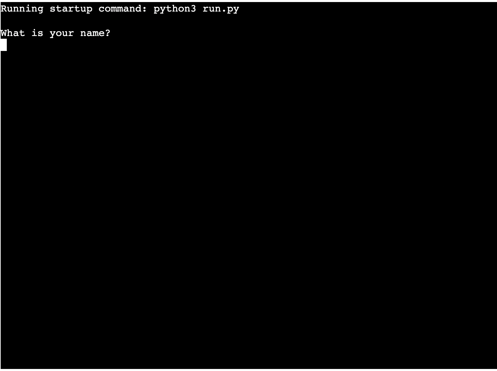
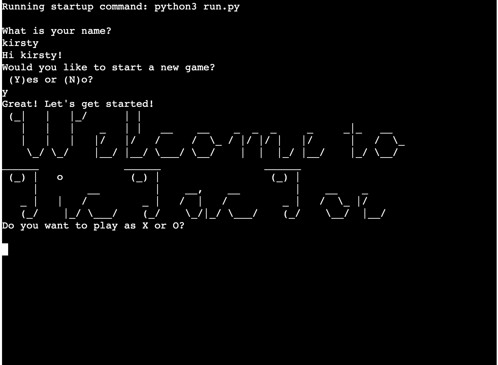
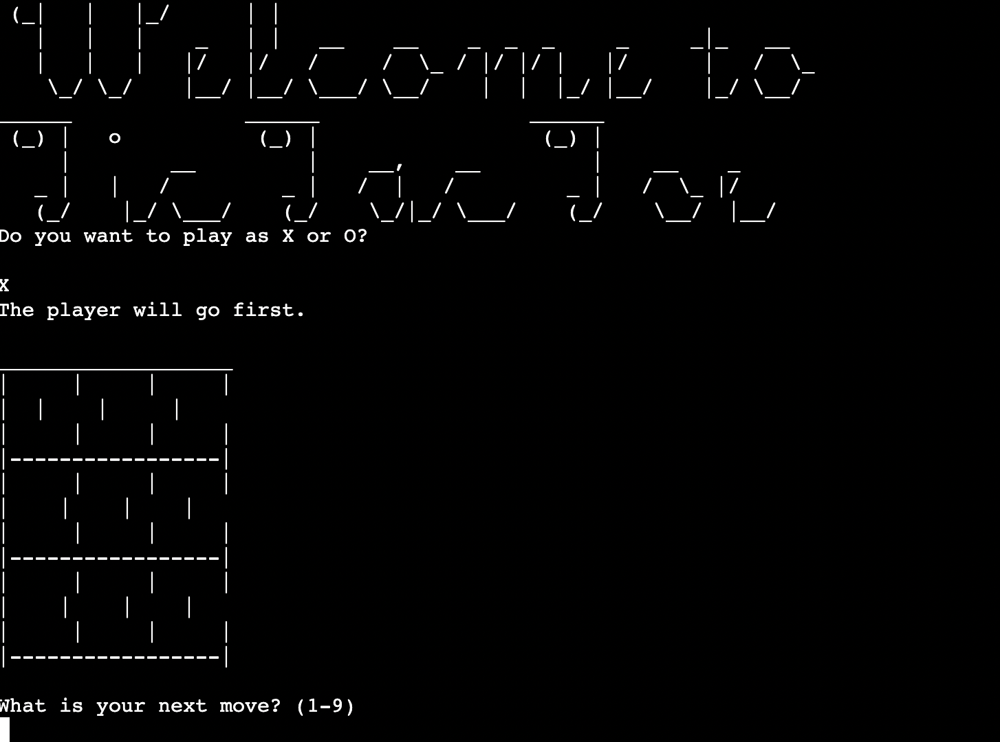
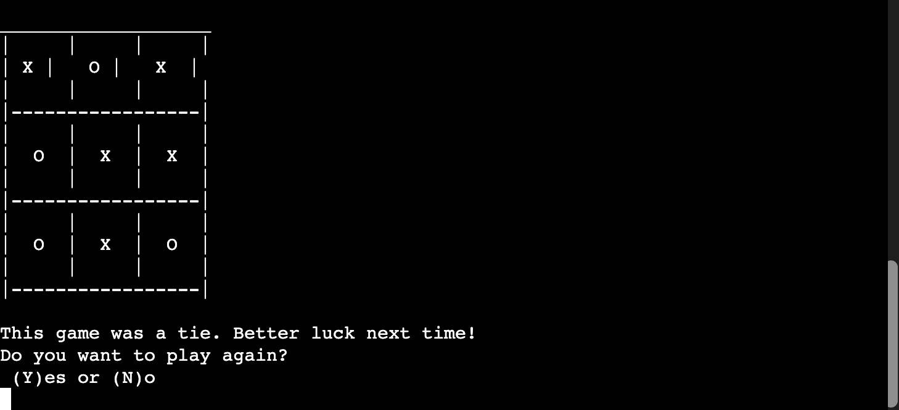

# Tic Tac Toe Game

## Introduction

The Tic Tac Toe Game or noughts and crosses is traditionally a pen and pencil game for two players who take turns to mark either an X or O (one for each player) on a 3 x 3 grid. 

I wanted to make this game digitally accessible and against the computer so one players can have fun with it as well. 

The live site is available at [Tic Tac Toe Game](https://tic-tac-toe16.herokuapp.com/) on Heroku.

--- Am I responsive Image ---

## How to Play

At the beginning of the game, the program will ask the player who marker they want to play with. It will be either an X or an O. The computer will play the other one.  The aim of the game is to get a full row, column, or diagonal line of your marker. Whoever gets this first is the winner. 

## Planning Stages

### User Goals

To build a terminal version of the classic Tic Tac Toe Game that is only one player against the computer. 

* The game should be easy to play.
* The game should be fun to play.
* The game should be entertaining enough for the player to come back and play again.

### Design

* I wanted the game to have a retro feel with the font and grid to match the terminal view on Heroku.
* I used the FIGlet fonts to generate the style of fonts that I wanted for the title message.

## Current Features

* When the app is first started, the app will ask for the player's name
  
  

* Welcome Screen
  
  

* The blank playing board before any moves are taken
  
  

* After the game has finished with the full board. In this example it is a tie with the computer
  
  

## Future Features

* I want to implament different difficulty levels as a more challenging experience for users.

## Testing

I manually tested the project by doing the following:

* Tested the code through the [Pep8 Online Validator](http://pep8online.com/)
* Manually tested by using incorrect user inputs to confirm error messages were correctly being shown
* Tested in the local terminal on VS Code and on Heroku.

## Technologies Used

* Language used was Python
* Libraries that were imported to use was the Random Library.

## Deployment

The app was deployed via Heroku using Code Institute’s mock terminal. 

### Steps to deploy the app:

1.  Visit [Heroku](https://www.heroku.com/) and log in or create a new account
2.  Click on the new button and then create new app
3.  Use a unique name for the app - If the name is already taken, Heroku will advise the user to pick another one
4.  Selet your appropriate region. In my case I chose Europe as this is where I am based
5.  Click Create App and this will take you to the App's dashboard
6.  In "Settings" select "BuildPack" and select Python and Node.js. (Python must be at the top of the list).
7.  Whilst in settings, under the Reveal Config Vars section, click "Add" and input the "Key" as **Port** and the "Value" as **8000**
8.  Click on the Deploy option from the top menu
9.  Select Github as the deployment method and then confirm you want to connect to Github by pressing the "Connect to Github" button.
10. Search for the Github repository and click connect when located
11. To deploy the app, you can either choose **Enable Automatic Deploys** or **Deploy Branch** for manual deployment.
12. Heroku will now deploy the app.

## Credits

* For the FIGlet Welcome Screen font, I used [Doodle Nerd](https://doodlenerd.com/web-tool/figlet-generator)